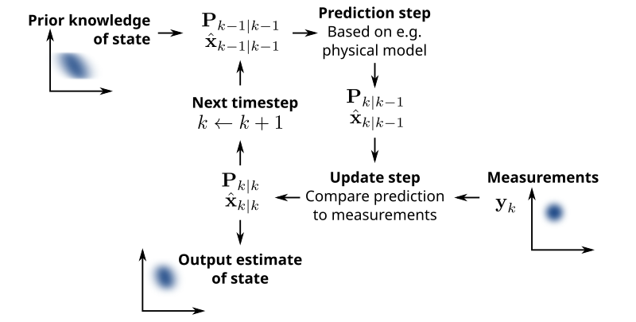
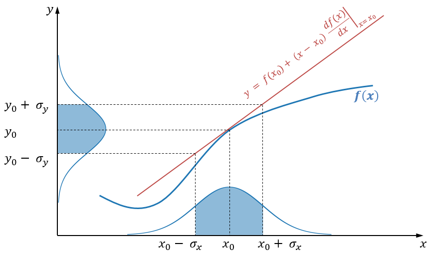
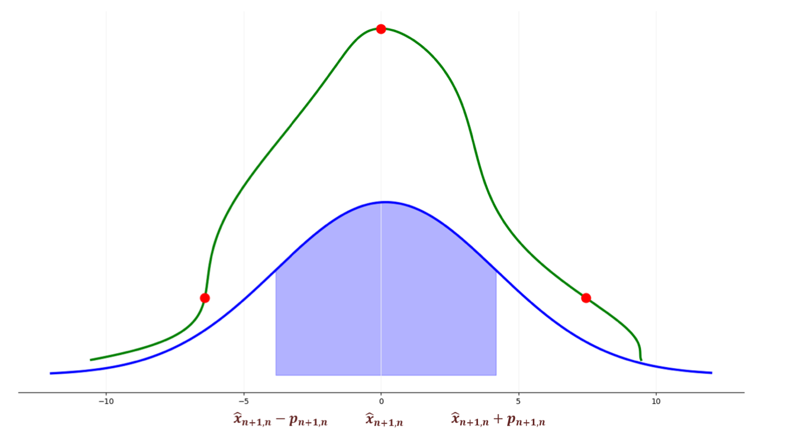

Why Should DL Researchers Care about Kalman Filters?
----------------------------------------------------

Despite their foundational role in probabilistic state-space modelling, Kalman filters remain surprisingly underrepresented in the deep learning community. Our new framework **Kalman filter and his friends** aims to change that.
Kalman filters serve as the backbone for many advanced models, including:

- Gaussian Processes, used for regression and time-series analysis.
- State-Space Models (SSMs) like S4/S6, crucial for sequence modelling in modern deep learning.
- Hidden Markov Models (HMMs), widely applied in speech recognition and bioinformatics.
- Recurrent Neural Networks (RNNs), which share conceptual similarities in sequential data processing.

Kalman filters provide a principled way to estimate hidden states from noisy observations, something neural networks often do implicitly but with less interpretability. Kalman filter is extremely powerful when the noise in the data is roughly Gaussian, and a lot of tasks in DL fit into this description. By integrating these filters into DL pipelines, we gain:

- Stronger theoretical grounding – Kalman-based approaches have well-defined probabilistic properties.
- Better uncertainty quantification – Unlike many DL models, Kalman filters explicitly model uncertainty.
- Efficiency & interpretability – Compared to deep neural networks, Kalman filters can be computationally efficient and easier to analyze.

Theoretical Background
----------------------

We will be working with a discrete-time linear dynamic system. It consists of two parts - a state equation and an observation equation. We have state variable :math:`x_t` and our observed variable :math:`y_t`. We try to predict :math:`y_t` using :math:`x_t`. We assume there is a linear relationship between these two variables and that there is Gaussian noise in "measurements" of both of these variables:

.. math::

   x_{t+1} = A_t x_t + w_t

.. math::

   y_t = H_t x_t + v_t

Where:

- :math:`x_t` is the hidden state at time :math:`t`
- :math:`A_t` is the transition matrix
- :math:`y_t` is the observation
- :math:`H_t` is the observation matrix

The stochastic nature of the process is expressed with:

.. math::

   w_t \sim \mathcal{N}(0, Q), \quad v_t \sim \mathcal{N}(0, R)

The Kalman filter is an online algorithm that estimates the hidden state of a dynamic system based on noisy observations. The model updates its estimation of the weights sequentially as new data comes in and provides an optimal solution (in a least-squares sense).

Algorithm
---------

At its core, the Kalman filter operates on a predict-update cycle. This process is Bayesian, meaning the filter maintains a probabilistic belief over the system’s state, updating it as new information comes in.

**1. Predict (estimation) step**

Given the previous state estimate :math:`\hat{x}_{t-1|t-1}`, we predict the next state:

.. math::

   \hat{x}_{t|t-1} = A \hat{x}_{t-1|t-1}

.. math::

   P_{t|t-1} = A P_{t-1|t-1} A^T + Q

**2. Update (correction) step**

- Compute Kalman Gain:

  .. math::

     K_t = P_{t|t-1} H^T (H P_{t|t-1} H^T + R)^{-1}

- Update state estimate:

  .. math::

     \hat{x}_{t|t} = \hat{x}_{t|t-1} + K_t (y_t - H \hat{x}_{t|t-1})

- Update uncertainty:

  .. math::

     P_{t|t} = (I - K_t H) P_{t|t-1}

Kalman Gain
-----------

The Kalman Gain, denoted as :math:`K_t`, serves as an adaptive weighting mechanism in the estimation step. It assigns more weight to the more accurate estimate — typically, the one with a smaller Mean Squared Error (MSE).  

.. math::

   K = \frac{\sigma^2_{\text{EST}}}{\sigma^2_{\text{MEA}} + \sigma^2_{\text{EST}}}

As a result:

- A larger :math:`K` suggests greater trust in the new measurements.
- A smaller :math:`K` implies greater confidence in the model prediction.

Non-Linear Kalman Filters
-------------------------

You might have noticed that everything above is just a fancy *linear* model. To deal with non-linearity, there exist several modifications of Kalman filters.

Extended Kalman Filter (EKF)
~~~~~~~~~~~~~~~~~~~~~~~~~~~~

EKF uses first-order Taylor approximation (linearization). The only change is that instead of matrices :math:`A` and :math:`H`, we use their Jacobians.

.. math::

   P_{t|t-1} = \frac{\partial a}{\partial x} P_{t-1|t-1} \left( \frac{\partial a}{\partial x} \right)^T + Q

Unscented Kalman Filter (UKF)
~~~~~~~~~~~~~~~~~~~~~~~~~~~~~

The Unscented Kalman Filter avoids derivatives and instead uses the **unscented transform**:

1. Select :math:`2N` sigma points from the input distribution.
2. Propagate them through the non-linear function:

   .. math::

      \mathcal{X}_{t+1, t} = \left[ \mathcal{X}_{t+1, t}^{(0)}, \mathcal{X}_{t+1, t}^{(1)}, \ldots, \mathcal{X}_{t+1, t}^{(2N)} \right]

3. Compute sigma point weights :math:`w_i`.
4. Use them to estimate mean and covariance:

   .. math::

      \hat{\boldsymbol{x}}_{t + 1, t} = \sum_{i=0}^{2N} w_i \mathcal{X}_{t+1, t}^{(i)}

   .. math::

      \boldsymbol{P}_{t + 1, t} = \sum_{i=0}^{2N} w_i \left( \mathcal{X}_{t+1, t}^{(i)} - \hat{\boldsymbol{x}}_{t + 1, t} \right)^2

Our Framework
-------------

We provide a clean, minimalistic, and extensible implementation of different Kalman filter variants:

- Standard Kalman Filter – The foundational model for linear state estimation.
- Extended Kalman Filter (EKF) – Handling nonlinear dynamics through local linearization.
- Unscented Kalman Filter (UKF) – A more accurate approach using sigma-point sampling.
- Variational Kalman Filters – Leveraging modern probabilistic techniques for scalable inference.

After installing the package, you can quickly set up and run a Kalman filter with just a few lines of code.

.. code-block:: python

    import numpy as np
    from kalman.filters import KalmanFilter

    # Example: 1D constant position model
    A = np.array([[1]])      # State transition matrix (position stays the same)
    H = np.array([[1]])      # Observation matrix (we observe the position directly)
    Q = np.array([[0.01]])   # Process noise covariance
    R = np.array([[1]])      # Observation noise covariance
    x0 = np.array([[0]])     # Initial state estimate 
    P0 = np.array([[1]])     # Initial covariance estimate

    kf = KalmanFilter(A, H, Q, R, x0, P0)

    # Simulated noisy measurements
    measurements = [1.2, 0.9, 1.0, 1.1, 0.95]

    for z in measurements:
        kf.predict()
        kf.update(np.array([[z]]))
        print("Current state estimate:", kf.x.flatten()[0])

